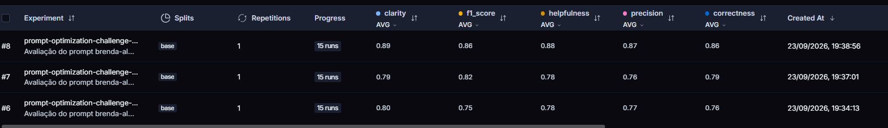

# Otimização e Avaliação de Prompts com LangChain e LangSmith

Projeto para transformar relatos de bugs em User Stories, comparando um prompt original (v1) com uma versão otimizada (v2). O fluxo inclui pull do LangSmith Hub, refatoração, push e avaliação sobre um dataset de 15 exemplos.

O critério de aprovação é atingir **média ≥ 0,8 em cada uma das cinco métricas**, além de média geral ≥ 0,8: Helpfulness, Correctness, F1-Score, Clarity e Precision.

## Técnicas Aplicadas (Fase 2)

As técnicas estão implementadas em [bug_to_user_story_v2.yml](prompts/bug_to_user_story_v2.yml).

### Few-shot Learning

Foram incluídos três pares de entrada e saída para demonstrar como transformar relatos em User Stories. A escolha busca tornar o formato e o nível de detalhe esperados mais claros por meio de exemplos concretos.

| Exemplo aplicado | Comportamento demonstrado |
| --- | --- |
| Botão Adicionar ao Carrinho não funciona para o produto ID 1234 | Preservar o identificador no contexto e descrever o resultado funcional esperado. |
| `GET /orders` retorna HTTP 500 para usuários com mais de 100 pedidos | Manter endpoint, código HTTP e condição de reprodução na história e nos critérios de aceitação. |
| Relatório leva 45 segundos, com falta de índice em `customer_id` e meta de 30 segundos | Preservar causa conhecida, coluna afetada e limite mensurável, sem substituir esses dados por hipóteses. |

### Role Prompting

O prompt define o papel de **Engenheiro de Software Sênior especializado em análise de bugs, requisitos e refinamento de User Stories**.

Esse papel foi escolhido para orientar a resposta à análise de requisitos, conciliando a necessidade do usuário com os detalhes técnicos fornecidos. Na prática, o exemplo de `GET /orders` mantém o benefício de consultar o histórico e também a condição técnica que provoca o erro.

### Estrutura da resposta e Skeleton of Thought

A seção `FORMATO` estabelece uma sequência: **User Story → Contexto → Critérios de Aceitação**. Essa estrutura organiza a resposta e facilita verificar se o comportamento esperado e as condições de resolução foram contemplados.

Exemplo do formato aplicado:

```text
User Story:
Como <ator>,
eu quero <comportamento esperado>,
para que <objetivo ou benefício>.

Contexto:
<informações funcionais e técnicas relevantes>

Critérios de Aceitação:
- Dado que <contexto>
- Quando <ação ou condição>
- Então <resultado esperado>
- E <demais condições relevantes>
```

O contexto é obrigatório quando há informações técnicas, condições de reprodução, erros, restrições ou métricas relevantes; é omitido quando apenas repetiria a história. A técnica corresponde ao sentido de Skeleton of Thought usado no enunciado, como estruturação da resposta em etapas. A implementação utiliza um template de saída, sem geração e expansão separadas de um esqueleto.

### Análise em etapas e regras complementares

A seção `ANÁLISE` orienta a identificação de ator, funcionalidade, comportamento atual, resultado esperado, informações técnicas e condições de resolução antes de responder. Essa orientação se aproxima de Chain of Thought por solicitar análise em etapas, mantendo apenas a resposta final visível.

Também foram aplicadas regras para:

- Preservar códigos de erro, endpoints, causas conhecidas, IDs e limites fornecidos.
- Evitar inventar tecnologias, causas, valores ou regras de negócio.
- Pedir informações essenciais quando o relato for insuficiente.
- Separar bugs independentes em User Stories distintas.
- Manter as instruções no `system_prompt` e o relato variável `{bug_report}` no `user_prompt`, delimitado por `---`.

Few-shot Learning e Role Prompting atendem à combinação de duas técnicas exigida pelo projeto.

## Resultados Finais

### Avaliação do prompt v2

O screenshot disponível registra o experimento **#8**, criado em **23/09/2026 às 19:38:56**, com **15 runs** e uma repetição por exemplo. As cinco médias exibidas atendem ao mínimo de 0,8.

| Métrica | Média exibida no LangSmith | Critério |
| --- | ---: | --- |
| Helpfulness | 0,88 | Atingido |
| Correctness | 0,86 | Atingido |
| F1-Score | 0,86 | Atingido |
| Clarity | 0,89 | Atingido |
| Precision | 0,87 | Atingido |

A média das cinco notas arredondadas acima é **0,872**. As médias não demonstram que cada exemplo individual recebeu nota ≥ 0,8.



A imagem também registra os experimentos #6 e #7 com métricas abaixo do limite. Elas são baseado nas primeiras otimizações que foram evoluindo para poder estar acima da média de 0,8.

### Comparação entre v1 e v2: o que mudou e por quê

| Aspecto | Prompt original (v1) | Prompt otimizado (v2) | Motivo da alteração |
| --- | --- | --- | --- |
| Papel | Assistente genérico que transforma bugs em tarefas. | Engenheiro de Software Sênior com foco em bugs e requisitos. | Direcionar a análise para User Stories acionáveis. |
| Instruções | Solicitação breve para gerar uma User Story. | Objetivo, análise, regras de inferência e restrições explícitas. | Reduzir ambiguidades e informações sem suporte no relato. |
| Exemplos | Não apresenta exemplos de entrada e saída. | Três exemplos funcionais e técnicos. | Demonstrar o formato e a preservação de detalhes. |
| Formato | Não define seções nem critérios de aceitação. | User Story, contexto quando necessário e critérios verificáveis. | Facilitar leitura, implementação e validação. |
| Detalhes técnicos | Não orienta sua preservação. | Exige manter erros, endpoints, IDs, causas e metas fornecidos. | Evitar histórias genéricas que perdem informações necessárias à correção. |
| Casos especiais | Não define tratamento. | Solicita dados faltantes e separa bugs independentes. | Evitar respostas inventadas ou histórias com escopos misturados. |
| System e User | Inclui o relato no system e também no user. | Concentra instruções no system e o relato no user. | Separar orientações fixas da entrada variável. |

Arquivos comparados: [v1](prompts/bug_to_user_story_v1.yml) e [v2](prompts/bug_to_user_story_v2.yml). 

### Evidências no LangSmith


| Evidência exigida | Evidência disponível / pendência |
| --- | --- |
| Dataset com 15 exemplos | [Dataset local](datasets/bug_to_user_story.jsonl) com 15 registros; o screenshot mostra 15 runs. 
| Execuções de v2 com notas ≥ 0,8 | Screenshot do experimento #8 acima, com todas as cinco médias acima do mínimo. |
| Tracing detalhado de pelo menos 3 exemplos | https://smith.langchain.com/public/cb06ade4-c109-42c4-bd41-9aa2d43cd775/d |


## Como Executar

### Pré-requisitos e dependências

- Python 3.10 ou superior, com `pip` e suporte a ambientes virtuais.
- Conta no LangSmith, chave de API e acesso ao workspace usado no projeto.
- Chave de API do provedor escolhido: Google Gemini ou OpenAI, com acesso aos modelos configurados.
- Conexão à internet para pull, push, inferência e envio das avaliações.

As versões das dependências estão fixadas em [requirements.txt](requirements.txt): LangChain, LangSmith, integrações com os provedores, python-dotenv, PyYAML, Pydantic e pytest. As chamadas aos modelos estão sujeitas às cotas e à cobrança do provedor.

Execute os comandos a seguir na raiz do repositório.

### 1. Criar o ambiente e instalar as dependências

No Windows PowerShell:

```powershell
python -m venv venv
.\venv\Scripts\Activate.ps1
python -m pip install -r requirements.txt
Copy-Item .env.example .env
```

No Linux ou macOS:

```bash
python3 -m venv venv
source venv/bin/activate
python -m pip install -r requirements.txt
cp .env.example .env
```

Copie o arquivo de exemplo somente na primeira configuração, preservando um `.env` já configurado.

### 2. Configurar o arquivo `.env`

Preencha as variáveis conforme [.env.example](.env.example):

```dotenv
LANGSMITH_TRACING=true
LANGSMITH_ENDPOINT=https://api.smith.langchain.com
LANGSMITH_API_KEY=<sua-chave-langsmith>
LANGSMITH_PROJECT=prompt-optimization-challenge-resolved
USERNAME_LANGSMITH_HUB=<seu-usuario-no-hub>

LLM_PROVIDER=google
LLM_MODEL=gemini-2.5-flash
EVAL_MODEL=gemini-2.5-flash
GOOGLE_API_KEY=<sua-chave-google>
```

Para usar OpenAI, substitua a configuração do provedor e dos modelos:

```dotenv
LLM_PROVIDER=openai
LLM_MODEL=gpt-4o-mini
EVAL_MODEL=gpt-4o
OPENAI_API_KEY=<sua-chave-openai>
```

Esses são os modelos indicados no arquivo de configuração do projeto; use modelos disponíveis na sua conta. `LLM_MODEL` gera as User Stories e `EVAL_MODEL` executa as avaliações. Não publique as chaves no repositório.

### 3. Fazer pull do prompt original

```bash
python src/pull_prompts.py
```

O script busca `leonanluppi/bug_to_user_story_v1` no Hub e salva o conteúdo em `prompts/bug_to_user_story_v1.yml`.

### 4. Revisar o prompt otimizado e fazer push

Revise `prompts/bug_to_user_story_v2.yml`, mantendo a variável `{bug_report}` e os campos `system_prompt` e `user_prompt`.

```bash
python src/push_prompts.py
```

O script publica `bug_to_user_story_v2` no Hub da conta autenticada e imprime sua URL. A avaliação busca `{USERNAME_LANGSMITH_HUB}/bug_to_user_story_v2`, portanto o usuário configurado deve corresponder ao proprietário do prompt publicado.

### 5. Avaliar e consultar os resultados

```bash
python src/evaluate.py
```

O script utiliza o dataset `datasets/bug_to_user_story.jsonl`, com 15 exemplos, e cria o dataset remoto `<LANGSMITH_PROJECT>-eval` se ele não existir. Quando já existe, reutiliza os exemplos remotos sem sincronizar alterações do arquivo local.

A avaliação busca a versão publicada de v2, executa uma repetição por exemplo e registra um experimento no LangSmith. Cada métrica base é calculada uma vez por resposta. As métricas derivadas usam:

```text
Helpfulness = (Clarity + Precision) / 2
Correctness = (F1-Score + Precision) / 2
```

O resumo no terminal usa os feedbacks do próprio experimento. Notas ausentes ou inválidas sinalizam avaliação incompleta. O experimento é registrado também quando as notas ficam abaixo do limite; aprovação exige todas as médias ≥ 0,8 e média geral ≥ 0,8.

No LangSmith, localize o dataset `<LANGSMITH_PROJECT>-eval` e o experimento cujo nome foi impresso no terminal. Use as execuções individuais para inspecionar entradas, respostas, feedbacks e traces.

### 6. Realizar de 3 a 5 ciclos de melhoria

Cada ciclo consiste em analisar as métricas e respostas, ajustar v2, publicar novamente e avaliar:

```bash
python src/push_prompts.py
python src/evaluate.py
```

Os **3 a 5 ciclos são manuais**. Uma execução do script não dispara várias iterações de otimização. Registre as alterações e o experimento correspondente a cada ciclo; a quantidade de ciclos não garante aprovação.

### 7. Executar os testes

```bash
python -m pytest tests/test_evaluate.py -q
python -m pytest tests/test_prompts.py -v
```

Os testes de avaliação verificam o reaproveitamento das métricas, as médias do experimento e o tratamento de notas inválidas com chamadas simuladas. No estado atual, `tests/test_prompts.py` contém métodos com `pass`; sua execução ainda não comprova os seis requisitos de validação dos prompts.

### 8. Completar as evidências da entrega

Inclua em **Resultados Finais → Evidências no LangSmith** o link público do dataset com os experimentos, uma captura da lista com 15 exemplos e links ou screenshots dos traces de pelo menos três exemplos. Mantenha também a captura das cinco métricas aprovadas, identificando o experimento e a versão do prompt avaliada.
